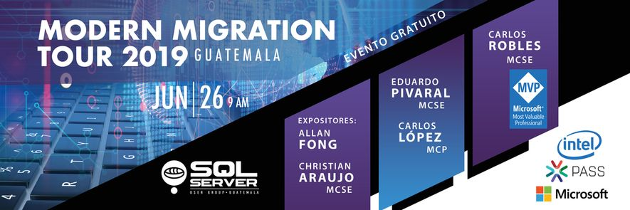

# Presentaciones

Sesion | Speaker
--- | --- 
Beating the End of Support for SQL Server 2008/R2 | [Christian Araujo](Migration%20Tour%20beating%20the%20EOS%20-%20Christian%20Araujo.pdf)
Modernizing with SQL Server the Right Way (**Migration process**) | [Allan Fong](Modernizing%20SQL%20Server%20The%20Right%20Way%20-%20Allan%20Fong.pdf)
Modernizing with SQL Server the Right Way (**Post-Migration process**) | [Eduardo Pivaral](Modernizing%20SQL%20Server%20The%20Right%20Way%20-%20Eduardo%20Pivaral.pdf)
Modernizing with SQL Server 2019 & Intel (**New Intel hardware capabilities**) | [Carlos Lopez](Modernizing%20with%20SQL%20Server%202019%20and%20Intel%20-%20Carlos%20Lopez.pdf)
Modernizing with SQL Server 2019 & Intel (**New features, platforms**) | [Carlos Robles](The%20Modern%20Data%20Platform%20-%20Carlos%20Robles.pdf)

# Contacto
Para cualquier comentario o duda envia un correo a gtssug@pass.org

Seguinos en [Facebook](https://www.facebook.com/groups/gtssug/) para conocer mas acerca de este y otros eventos.
